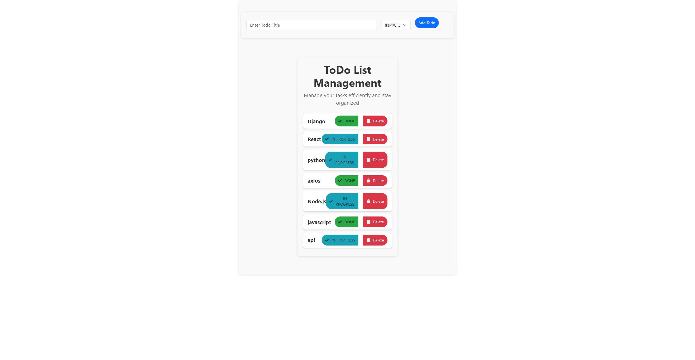

### 📝 ToDo App Using Django RestFramework + React


<p align="center">
  
  
</p>


This project utilizes Django RestFramework for the backend and React for the frontend, creating a seamless and efficient task management application.

#### Project Contains:

- **[Backend Repository](https://github.com/abdulrahim-ramadan/Django-React-ToDO-APP/tree/main/backend)**
- **[Frontend Repository](https://github.com/abdulrahim-ramadan/Django-React-ToDO-APP/tree/main/frontend)**

## 📑 Contents
- [📸 Demo](#demo)
- [✨ Features](#features)
- [⚙️ Installation](#installation)
- [🚀 Usage](#usage)
- [🔌 API Endpoints](#api-endpoints)
- [🛠️ Technologies](#technologies)
- [🤝 Contributing](#contributing)
- [📄 License](#license)

## 📸 Demo


## ✨ Features
- 🔐 User registration and login
- 📝 Create, edit, and delete 
- ✅ Mark tasks as completed
- 🔄 Real-time updates
- 📱 Responsive design

## ⚙️ Installation

### Tech Stack:
- Backend: Python Django, Django RestFramework
- Frontend: React, Bootstrap 5 Node.js
- Additional Technologies: CORS Headers, Axios

### Backend (Django)
1. Clone the repository:
    ```sh
    git clone https://github.com/abdulrahim-ramadan/Django-React-ToDO-APP.git
    cd Django-React-ToDO-APP/backend
    ```
2. Create and activate a virtual environment:
    ```sh
    python -m venv venv
    source venv/bin/activate  # On Windows: venv\Scripts\activate
    ```
3. Install dependencies:
    ```sh
    pip install -r requirements.txt
    ```
4. Run database migrations:
    ```sh
    python manage.py migrate
    ```
5. Start the development server:
    ```sh
    python manage.py runserver
    ```

### Frontend (React)
1. Navigate to the frontend directory:
    ```sh
    cd ../frontend
    ```
2. Install dependencies:
    ```sh
    npm install
    ```
3. Start the development server:
    ```sh
    npm start
    ```

## 🚀 Usage
1. Open your browser and go to `[http://127.0.0.1:8000/todo/]`.
2. Register or log in.
3. Start managing your tasks.

## 🔌 API Endpoints
- `GET /api/tasks/` - List all tasks
- `POST /api/tasks/` - Create a new task
- `PUT /api/tasks/<id>/` - Update a task
- `DELETE /api/tasks/<id>/` - Delete a task

## 🛠️ Technologies
- **Backend:** Django, Django REST Framework
- **Frontend:** React, Redux
- **Database:** SQLite (default), can be easily switched to PostgreSQL or MySQL

## 🤝 Contributing
Contributions are welcome! Please open an issue to report bugs or suggest features. Fork the repository and create a pull request for your changes.
